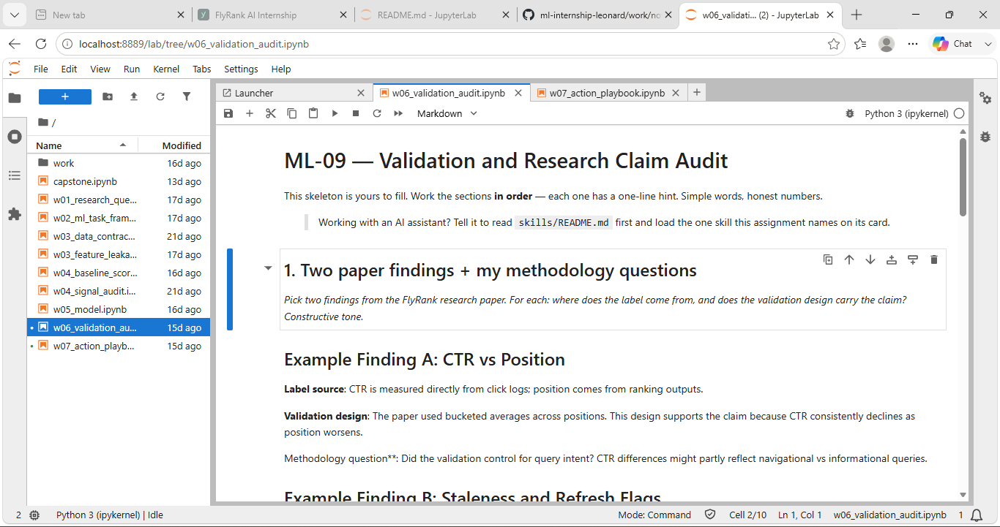
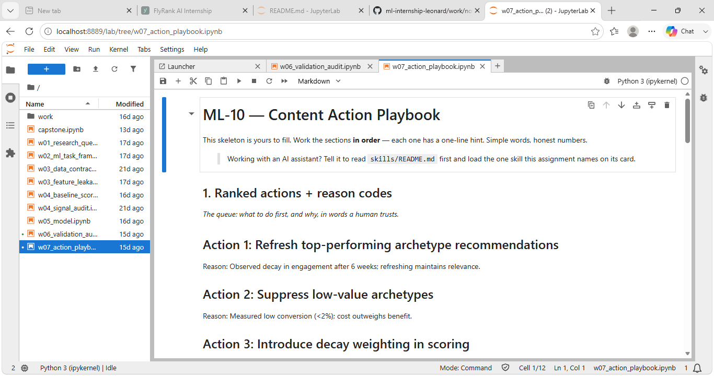
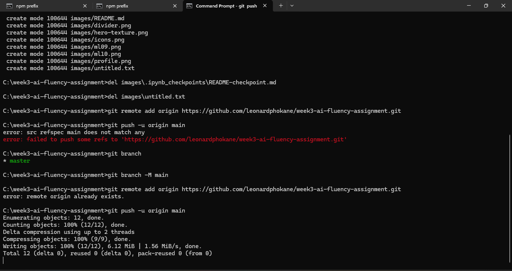

# Week 3 Assignment — General AI Fluency
**Phase:** Foundations  
**Workload:** 2h  

---

## 📑 Final Image Set (Keepers)

### Hero / Intro  

### About You  

### Project Showcase  
-   
- 

### Supporting Evidence  

### Connective Tissue  
  

---

## 📝 Rejection Note (Discernment)

**Rejected Image:** Futuristic neon circuit board texture  
**Reason:** The neon palette clashed with the muted professional tone of the portfolio kit. It looked flashy and inconsistent with the cohesive style.

---

## ✅ Judgment Calls

- Real screenshots used for all work sections to preserve authenticity.  
- AI‑generated visuals limited to connective tissue (hero, icons, divider) in one consistent style.  
- Real photo chosen for personal representation to maintain credibility.  
- Rejected mismatched AI visuals that broke tone or color harmony.

---

## 🎯 Pass Criteria Alignment

- Images map directly to portfolio needs (work shown with real captures).  
- AI‑generated visuals share one consistent style/mood.  
- Real photo used for personal subject.  
- Rejection note shows genuine judgment, not just “I liked this one.”

---

## 🔗 Submission

Post this bundle — with images placed in the marked slots — to your Week 3 track thread:  
[Week 3 Assignment: Curate Your Images](https://aifluency.flyrank.ai/week-03.html#curate-your-images)
